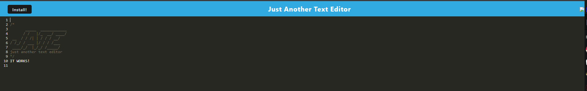

# text-editor

  ## Description
  I built a text editor that will save the text you write in it for later reference.  It will allow data to persist through going offline, update the DB once back, and it can be installed via webpack.  
  
  ## Table of Contents
  
  - [Installation](#installation)
  - [Tools](#tools)
  - [License](#license)
  - [Screenshots](#screenshots)
  - [Questions](#questions)
  
  
  ## Installation
  
  Download the repo, npm i, npm build, npm start.
  
  
  ## Tools
  
 Express, Babel, Webpack
  
  
  ## License

  
  
  ## Screenshots

  ## Questions

  If you have any questions about the project please contact me at.
  - [GitHub](https://github.com/Jsnyder159?tab=repositories)
  - Email: jw.snyder159@gmail.com